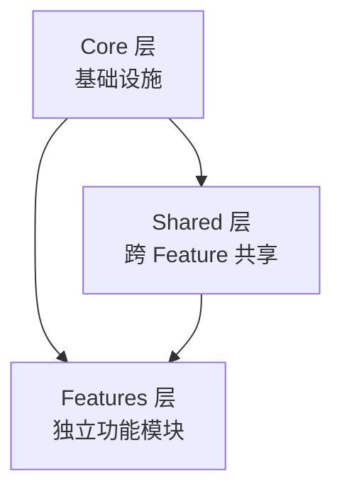
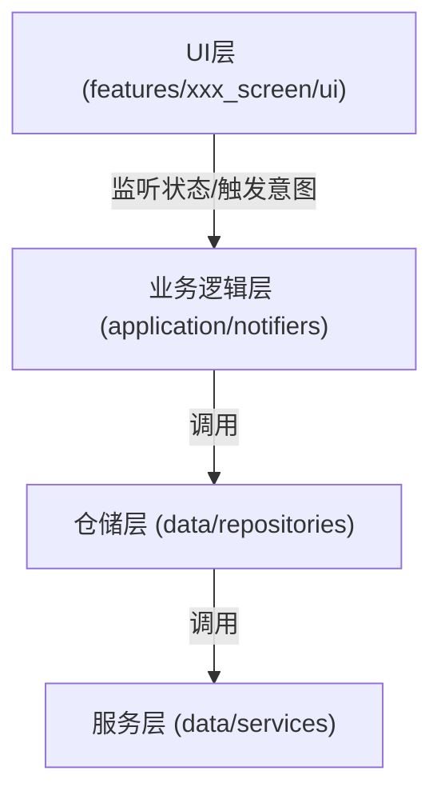

# 项目宪法 (Project Constitution)

> **指令说明**：本文件是项目的最高构建准则。作为 AI 助手，在生成代码、重构或解释逻辑时，**必须**同时遵守架构分层原则、Snippet 模板结构以及详细的代码规范。

## 0. 全局上下文 (Context & Imports)

在生成代码前，请默认假设项目具有以下基础路径别名和配置：

- **Core 层**（基础设施）: `import 'package:flutter_template/core/index.dart';`
  - 含 `CustomStatefulWidget`, `CustomStatelessWidget`, `themeProvider`, `langProvider`, `BaseResponse`
- **Shared 层**（共享业务）: `import 'package:flutter_template/shared/index.dart';`
  - 含 `application/`（全局 Notifier/Provider）、`data/`（Model/Repository/ApiService）、`widgets/`、`constants/`
- **Routing**: `import 'package:flutter_template/routing/index.dart';`
  - 含 `RoutePath`, `goRouterProvider`, `NavigatorUtilsCore`
- **Features**: `import 'package:flutter_template/features/index.dart';`
  - 各 Feature 的 UI 入口

> **注意**：`flutter_template` 是模板包名，实际项目中会替换为具体包名（如 `whats_ai`、`my_app`）。

---

## I. 核心架构原则 (Layered Architecture)

### 1. 三层架构



| 层级 | 目录 | 职责 |
|------|------|------|
| **Core** | `lib/core/` | 基础设施，不含业务逻辑 |
| **Shared** | `lib/shared/` | 跨 Feature 共享的业务逻辑和数据 |
| **Features** | `lib/features/` | 独立功能模块，按 Feature 隔离 |

### 2. 数据流向
严格执行单向依赖，禁止跨层反向调用：



### 3. 职责边界
- **UI 层**: 严禁包含业务逻辑。只负责 `build`，通过 `ref.read(provider.notifier).method()` 触发逻辑。
- **Notifier**: 纯状态管理。**UI 逻辑（如 SnackBar, Dialog）** 需通过状态回调或副作用处理，不能直接写在 Notifier 中。
- **Repository**: 数据聚合者。负责判断 `useMock`，负责 `DTO -> Entity` 转换，负责调用 API。
- **Service**: 纯粹的数据通道（Dio/Hive）。

### 4. Shared 与 Feature 的边界

| 维度 | `shared/` | `features/xxx_screen/` |
|------|-----------|------------------------|
| **作用域** | 全局，跨 Feature 共享 | 仅限当前 Feature 内部使用 |
| **application/notifiers** | 全局状态（Auth、User、Menu 等） | 页面专属状态（如 OrderFormNotifier） |
| **data/models** | 通用模型（UserEntity、BaseEntity） | 页面独有模型（如 OrderDetailEntity） |
| **data/repositories** | 通用仓库（AuthRepository） | 页面独有仓库（如 OrderRepository） |
| **判断标准** | ≥ 2 个 Feature 会用到 → 放 shared | 只有当前 Feature 用 → 放 feature |

---

## II. UI 组件开发模式 (Component Patterns)

根据组件复杂度，**严格区分**两种开发模式。AI 需根据需求判断使用哪一种 Snippet 逻辑。

### 模式 A：无状态/简单组件 (Lightweight)
*   **适用场景**: 纯展示组件、通用原子组件 (`widgets/`)、无生命周期依赖的组件。
*   **对应 Snippet**: `sw` (CustomStatelessWidget)
*   **结构**: **二层结构** (Class -> buildView)

```dart
// 1. 定义类
class MyWidget extends CustomStatelessWidget {
  const MyWidget({super.key});
  // 2. 渲染层 (覆盖 buildView)
  @override
  Widget buildView(BuildContext context, WidgetRef ref) => Container(...);
}
```

### 模式 B：页面/复杂组件 (Tri-Layer Architecture)
*   **适用场景**: 所有路由页面、含生命周期 (`initState/dispose`) 的组件。
*   **对应 Snippet**: `sfw` (CustomStatefulWidget)
*   **结构**: **三层分离结构** (Entry -> Logic -> View)

```dart
// 1. 入口层 (Entry): 参数定义
class MyScreen extends CustomStatefulWidget {
  const MyScreen({super.key});
  @override
  CustomState<MyScreen> createState() => _MyScreenState();
}

// 2. 逻辑层 (Logic): 生命周期、状态初始化
class _MyScreenState extends CustomState<MyScreen> {
  @override
  void initState() {
    super.initState();
    ref.read(myNotifierProvider.notifier).initData();
  }
  @override
  Widget build(BuildContext context) => _MyScreenView(this);
}

// 3. UI层 (View): 纯渲染，持有 State 引用
class _MyScreenView extends CustomStatefulView<MyScreen, _MyScreenState> {
  const _MyScreenView(super.state); // 必须透传 state
  @override
  Widget buildView(BuildContext context, WidgetRef ref) { ... }
}
```

---

## III. 目录与命名规范 (Directory & Naming)

### 1. 目录结构树
```text
lib/
├── core/                         # 基础设施层
│   ├── abstracts/                # 组件抽象基类
│   ├── config/                   # 项目配置（多客户端白牌）
│   ├── enums/                    # 全局枚举
│   ├── errors/                   # 异常类和错误映射
│   ├── extensions/               # Dart 扩展方法
│   ├── l10n/                     # 国际化
│   ├── middleware/               # 路由中间件（权限控制）
│   ├── mixins/                   # 通用 Mixin
│   ├── network/                  # 网络层（Dio + 拦截器）
│   ├── providers/                # 全局 Provider
│   ├── theme/                    # 主题系统
│   └── utils/                    # 工具类
├── routing/                      # 路由配置
│   ├── route_path.dart           # 路由路径常量
│   ├── routes.dart               # FlutterRouter 路由列表
│   ├── router.dart               # GoRouter 配置
│   └── navigator_keys.dart       # NavigatorKey
├── shared/                       # 共享层（跨 Feature）
│   ├── application/              # 全局业务逻辑
│   │   ├── notifiers/            # 全局状态（Auth、User、Menu 等）
│   │   └── providers/            # 全局依赖注入
│   ├── data/                     # 共享数据层
│   │   ├── models/               # 通用数据模型
│   │   ├── repositories/         # 通用仓库
│   │   ├── services/api/         # API 服务
│   │   └── mock/                 # Mock 数据
│   ├── constants/                # 全局常量
│   └── widgets/                  # 共享组件
│       ├── common/               # 通用组件（Ox 前缀）
│       ├── desktop/              # 桌面端组件
│       └── mobile/               # 移动端组件
├── features/                     # Feature 模块
│   └── {name}_screen/            # 每个 Feature 结构一致
│       ├── application/          # Feature 专属逻辑
│       │   ├── notifiers/
│       │   └── providers/
│       ├── data/                 # Feature 专属数据
│       │   ├── models/
│       │   ├── repositories/
│       │   └── services/
│       ├── ui/                   # UI 层
│       │   ├── desktop/index.dart
│       │   ├── desktop/widgets/  # 桌面端子组件
│       │   ├── mobile/index.dart
│       │   ├── mobile/widgets/   # 移动端子组件
│       │   └── index.dart        # 平台适配入口
│       └── README.md             # Feature 说明文档
├── app.dart                      # App 根组件
├── bootstrap.dart                # 启动初始化
└── main.dart                     # 入口文件
```

### 2. 命名规则
- **Feature 目录**: `{name}_screen/`（使用 `make create name=xxx` 脚手架创建）
- **页面入口文件**: `ui/index.dart`（平台适配入口）、`ui/desktop/index.dart`、`ui/mobile/index.dart`
- **子组件文件**: `{name}_widget.dart` / 类名 `{Name}Widget`
- **全局组件**: `ox_{name}.dart` / 类名 `Ox{Name}`
- **Feature README**: 每个 Feature 必须包含 `README.md` 说明文档

---

## IV. 状态与数据层规范 (State & Data)

### 1. Notifier 模板选择
根据业务场景选择对应的 Snippet：

| 场景 | 模板 | Snippet | 说明 |
|:---|:---|:---|:---|
| **详情/全局配置** | `AsyncNotifier` | `ntf` | `@Riverpod(keepAlive: true)`，单数据流。 |
| **分页列表** | `PaginatedNotifier` | `ntfp` | `@riverpod` (autoDispose)，混入 `PaginationMixin`，提供 `loadMore/refresh`。 |

### 2. Repository 规范 (`rep`)
- **Mock 控制**: 必须包含 `final bool useMock` 字段。
- **数据转换**: 必须在 Repository 层完成 `DTO` (网络层对象) 到 `Entity` (业务层对象) 的转换。
- **返回类型**: `Future<BaseResponse<List<Entity>>?>`.
- **存放目录**: 共享放 `shared/data/repositories/`，Feature 独有放 `features/{name}_screen/data/repositories/`

### 3. Provider 规范 (`prd`)
- **缓存策略**: 必须使用 `CacheStrategy` 包装 Entity。
- **依赖注入**: Repository 必须通过 `Provider` 注入 API 和 Cache。

#### CacheStrategy 使用指南 (CacheStrategy Guide)

**1. CacheStrategy (Unified Entry)**

统一的缓存入口，支持三种模式：

| 模式 | 说明 | 重启后 |
|------|------|--------|
| `CacheMode.memory` | 纯内存 LRU | 数据丢失 |
| `CacheMode.persistent` | 仅磁盘 | 数据保留 |
| `CacheMode.hybrid` | 内存 + 磁盘 | 数据保留 ✅ |

**基本用法**:

```dart
import 'package:flutter_template/shared/index.dart';

// 创建缓存（自动注册到 CacheRegistry）
final userCache = CacheStrategy<UserEntity>(
  mode: CacheMode.hybrid,
  cacheKey: 'user_cache',
  maxSize: 100,
  expiration: Duration(hours: 1),
  fromJson: UserEntity.fromJson,
  toJson: (e) => e.toJson(),
);

// 初始化
await userCache.init();

// 存取
await userCache.put('user_1', user);
final user = userCache.get('user_1');

// 清理过期
await userCache.cleanExpired();
```

**2. CacheRegistry (Unified Management)**

所有 `CacheStrategy` 默认自动注册，可统一管理：

```dart
// App 启动时（在 bootstrap.dart 中）
await CacheRegistry.initAll();       // 初始化所有缓存
await CacheRegistry.cleanExpiredAll(); // 清理所有过期数据

// 查看已注册的缓存
print(CacheRegistry.registeredKeys);

// 清空所有缓存
await CacheRegistry.clearAll();
```

---

## V. 代码红线 (Strict Code Standards)

### 禁止事项 (Don't)
- ❌ **禁止**直接使用 `Colors.xxx` -> ✅ 使用 `ref.watch(themeProvider).colors.primary`
- ❌ **禁止**硬编码尺寸/文本 -> ✅ 使用 `ref.theme.spacing` / `ref.lang`
- ❌ **禁止**在 UI 层 (`buildView`) 直接调用 API 或写 `try-catch`。
- ❌ **禁止**使用 `FutureProvider` 进行写操作（增删改）。

### 必须事项 (Do)
- ✅ **数据模型**: 所有 Entity/DTO 必须使用 `json_annotation` 生成，禁止手写 `fromJson`。
- ✅ **导出规范**: 严禁隐藏文件。所有目录下的文件（如 `abc.dart`）必须在同级 `index.dart` 中导出 (`export 'abc.dart';`)，外部调用必须通过目录级 `index.dart` 引用。
- ✅ **依赖管理**: 项目中禁止使用 `freezed` 及其相关依赖（`freezed_annotation`, `build_runner` 不受限，但不得运行 freezed 生成器）。
- ✅ **ID 类型**: 超过 15 位的 ID 或所有业务 ID 必须使用 `String` 类型。
- ✅ **注释**: 核心类和方法必须有文档注释。
- ✅ **Import**: 禁止使用相对路径导入上级目录。**同级目录下的文件引用必须使用相对路径**，禁止使用 `package:` 全路径导入同级文件。
- ✅ **Feature 文档**: 每个 Feature 目录必须包含 `README.md`，说明功能描述、目录结构、路由信息。

---

## VI. 测试规范 (Test-First)

- **Entity**: 100% 覆盖率 (测试 JSON 序列化/反序列化)。
- **Repository**: 测试 `useMock=true` 的情况以及 API 异常映射。
- **Notifier**:
    - 测试初始状态 (Loading)。
    - 测试数据获取成功 (Data)。
    - 测试分页逻辑 (`loadMore` 是否追加数据)。

---

## VII. 开发工作流 (Development Workflow)

### 1. 新建 Feature
```bash
make create name=order    # 自动生成 features/order_screen/ 完整目录 + README.md
```
然后在 `lib/routing/route_path.dart` 定义路径，在 `lib/routing/routes.dart` 注册路由。

### 2. VSCode Snippets 映射
AI 应根据指令意图选择以下模板：
- `sw` : 无状态原子组件 (Stateless)
- `sfw` : **所有页面 (Screen)** 及复杂组件 (Stateful - 3层分离)
- `ntf` : 标准状态管理 (AsyncNotifier)
- `ntfp`: 分页列表状态 (PaginationMixin)
- `rep` : 仓储层 (含 Mock/DTO转换)
- `prd` : 依赖注入 (含 CacheStrategy)

### 3. 常用 Make 命令

| 命令 | 说明 |
|------|------|
| `make install` | 安装依赖 |
| `make create name=xxx` | 创建 Feature 模块脚手架 |
| `make code` | 代码生成（Entity `.g.dart`） |
| `make watch` | 监听文件变化自动生成代码 |
| `make l10n` | 生成多语言文件 |
| `make lang` | 自动翻译并生成多语言 |
| `make icon` | 生成字体图标文件 |
| `make config name=xxx` | 切换白牌客户端配置 |
| `make start` | Web 端开发启动 |
| `make test` | 运行单元测试 + 集成测试 |
| `make test_all` | 运行所有测试 |
| `make check_tests` | 检查缺少测试的文件 |

---

## VIII. 治理 (Governance)

1. **Constitutional Primacy**: 此文档优于任何口头约定。
2. **Review Gate**: 不符合本规范的代码（如直接在 UI 写逻辑、页面未使用三层分离）将被拒绝。

## IX. 计划合规性检查 (Plan Compliance Checklist)

所有 Implementation Plan (`plan.md`) **必须**包含以下检查表，AI 需在生成计划时逐项自检：

| 维度 | 检查项 (Checkpoints) | Pass? |
|------|----------------------|-------|
| **Architecture** | 代码是否放在正确的层级（shared vs feature）？ | [ ] |
| **Interfaces** | Repository 是否返回 `Future<BaseResponse<T>>`？是否包含 `useMock`？ | [ ] |
| **Providers** | Provider 是否使用了 `CacheStrategy` 包装 Entity？ | [ ] |
| **Snippets** | 是否为每个新文件指定了正确的 Snippet (`sw/sfw/ntf/rep/prd`)？ | [ ] |
| **Data Flow** | 是否明确 Repository 负责 `DTO -> Entity` 转换？ | [ ] |
| **UI Rules** | 是否明确禁止硬编码颜色/尺寸，强制使用 `ref.theme`？ | [ ] |
| **Naming** | Feature 目录是否为 `{name}_screen/`？是否包含 `README.md`？ | [ ] |
| **Testing** | 计划中是否明确包含 Entity(100%) 和 Repository(80%) 测试？ | [ ] |

**Version**: 2.0.0 | **Ratified**: 2026-01-22 | **Last Amended**: 2026-02-12
